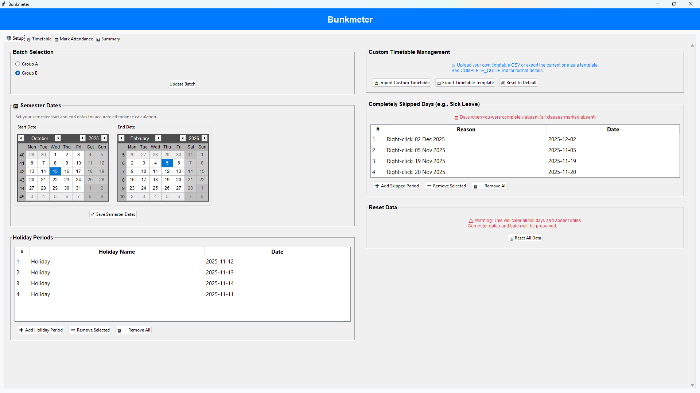
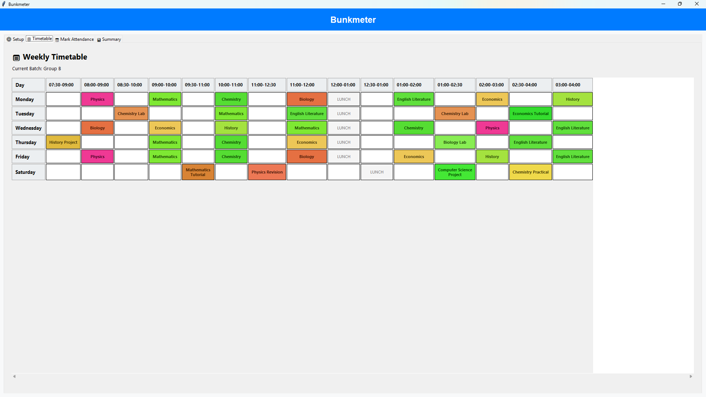
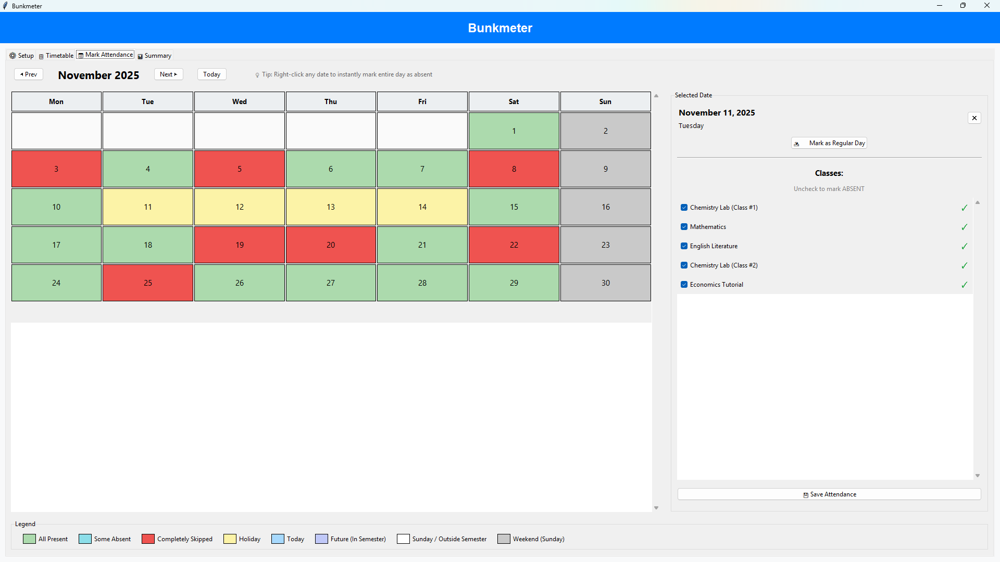
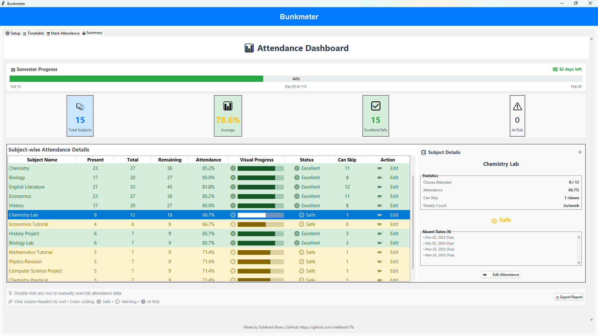

# MyAttendance

**Know exactly how many classes you can skip while staying above 75% attendance.**

---

## Install & Run

```bash
git clone https://github.com/siddhesh17b/MyAttendance.git
cd MyAttendance
pip install tkcalendar
python app.py
```

First run shows a setup wizard. Pick your batch, set semester dates, done.

---

## 4 Tabs, 4 Functions

### ⚙️ Setup Tab
- Select batch (B1/B3, B2/B4, or custom)
- Set semester start/end dates
- Add holidays (Diwali break, exam weeks, etc.)
- Add "skipped periods" (sick days, personal leave)
- Import your own timetable (CSV) or use the default
- Reset all data if needed



### 📋 Timetable Tab
- View your weekly schedule
- Each subject has a unique color
- Read-only display



### 📅 Mark Attendance Tab (Main Tab)
- Google Calendar-style monthly grid
- **Left-click date** → Mark individual subjects absent
- **Right-click date** → Mark entire day absent (one click)
- Colors show status at a glance:
  - 🟢 Green = All present
  - 🩵 Cyan = Some absent
  - 🔴 Dark Red = Completely skipped
  - 🟡 Yellow = Holiday
  - 🔵 Blue = Today
  - ⚪ White/Gray = Future/Weekend



### 📊 Summary Tab (Dashboard)
- **Semester progress bar** with days remaining
- **Stats cards**: Total subjects, average %, safe count, at-risk count
- **Subject table** with:
  - Attended / Total / Remaining classes
  - Attendance % with progress bar
  - Status (🟢 Excellent / 🟡 Safe / 🔴 At Risk)
  - **"Can Skip" count** - how many more you can bunk
- **Click any subject** → See details panel (absent dates, recovery needed)
- **Double-click subject** → Manual override (for cancelled classes, extras)
- **Export Report** → Save as text file



---

## Key Features

| Feature | Description |
|---------|-------------|
| **75% Threshold** | Calculates safe skips to stay above minimum |
| **Accurate Counting** | Counts actual class occurrences (not estimates) |
| **Holiday Aware** | Holidays don't count against attendance |
| **Present by Default** | Only tracks absences - less clicking |
| **Multiple Classes/Day** | Handles subjects appearing twice (labs, tutorials) |
| **Custom Timetable** | Import your own schedule via CSV |
| **Any Batch Names** | Works with B1/B3, Group A/B, Section X, anything |
| **Any Time Slots** | 8am-9am, 2pm-4pm, any format works |
| **Manual Override** | Set exact attended/total when auto-calc is wrong |
| **Responsive UI** | Resizes with window, works on any screen |
| **Offline** | No internet needed, all data stored locally |

---

## Custom Timetable

Don't want the default schedule? Import your own:

1. **Setup Tab** → **Export Timetable Template**
2. Edit the CSV (3 columns: Day, Time, Subject)
3. **Setup Tab** → **Import Custom Timetable**

### CSV Format:
```
MONDAY,09:00-10:00,Mathematics
MONDAY,10:00-11:00,Physics
MONDAY,02:00-04:00,CN Lab (B1&B3) / DAA Lab (B2&B4)
```

**Rules:**
- Days must be UPPERCASE (MONDAY, TUESDAY...)
- Time format is flexible
- Batch-specific: `Subject1 (Batch1) / Subject2 (Batch2)`
- Skip lunch rows (or name them "Lunch" - they're ignored)

📖 See **[COMPLETE_GUIDE.md](COMPLETE_GUIDE.md)** for full details.

---

## Files

| File | What It Does |
|------|-------------|
| `app.py` | **Run this** |
| `data.json` | Your attendance data (auto-created) |
| `custom_timetable.json` | Your imported timetable |
| `timetable_template.csv` | Sample CSV to edit |
| `COMPLETE_GUIDE.md` | Full guide |

---

## Troubleshooting

| Problem | Fix |
|---------|-----|
| Won't start | `pip install tkcalendar` |
| ModuleNotFoundError | Run from inside the MyAttendance folder |
| Wrong attendance | Check semester dates in Setup tab |
| Subject missing | Import a timetable with your subjects |
| Need fresh start | Setup Tab → Reset Data |

---

Made by **Siddhesh Bisen** • [GitHub](https://github.com/siddhesh17b)
